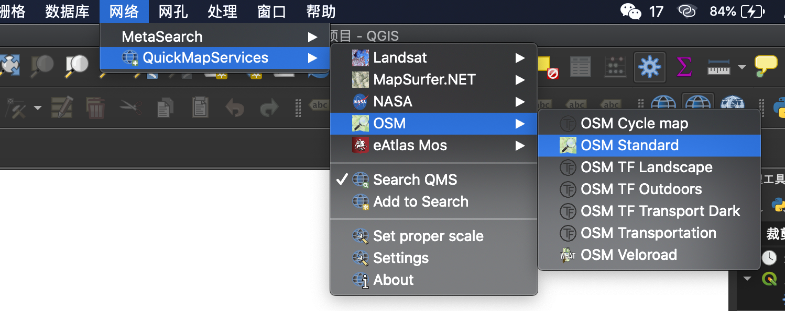
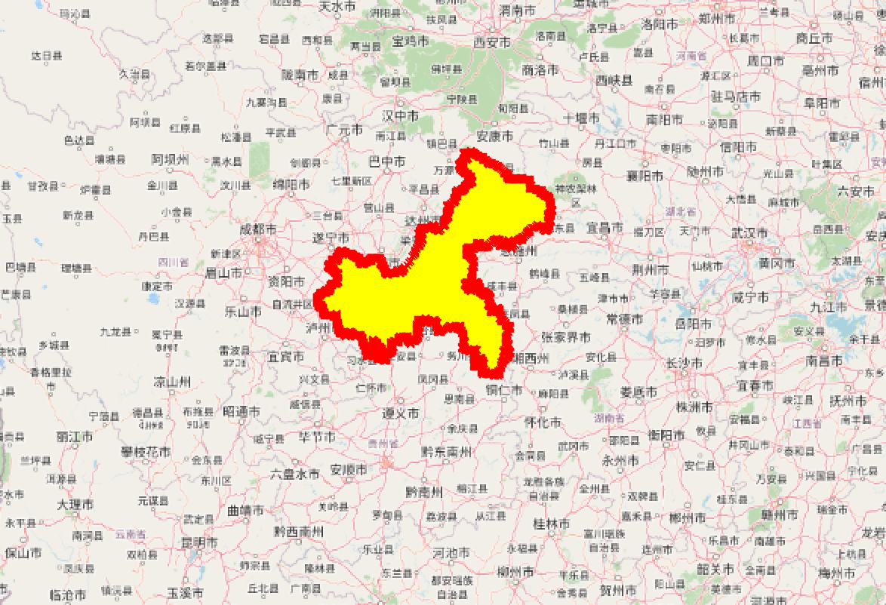
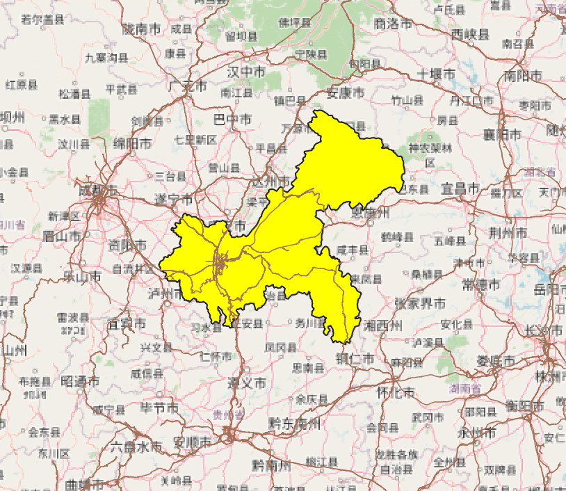
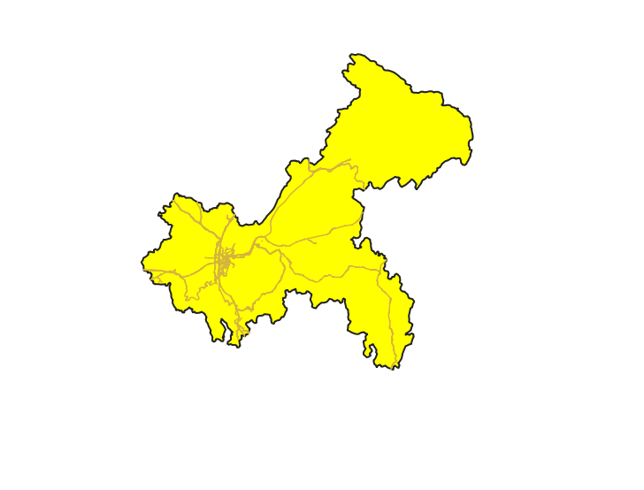

# GIS路网提取
## 1.下载QGIS
1. 到[QGIS](https://www.qgis.org/en/site/forusers/download.html)官网进行软件下载
## 2.获取矢量行政区划shp文件
1. 获取行政区划的relation code
 1. 采用[Query](http://www.overpass-api.de/index.html)法获取城市id
  1. 进入Query and Convert Forms，在Overpass API Query Form中输入以下代码
  ```osmscript
  <osm-script>
   <query type="relation">
    <has-kv k="boundary" v="administrative"/>
    <has-kv k="name:zh" v="重庆市"/>
   </query>
  <print/><osm-script>
  ```
  默认输出为xml格式，也可以定义为json格式，只需要将`<osm-script>`修改为`<osm-scriptoutput="json">`
  通过保存的Interpreter文件，找到relation id = “913069”

4. 根据编码下载shp

   1. 通过CURL命令下载，

      ```livescript
      curl -f -o file.zip --url "https://wambachers-osm.website/boundaries/exportBoundaries?cliVersion=1.0&cliKey=52d97a3b-3fc1-44cd-bd9a-e8c1c9468bab&exportFormat=shp&exportLayout=levels&exportAreas=land&union=false&selected=913069"
      ```

      如果下载速度过慢，可以使用替代方法：通过[http://polygons.openstreetmap.fr/?id=RELATIONID](http://polygons.openstreetmap.fr/?id=)获取行政区域的geojson文件。其中的RELATIONID则是上个步骤得到的城市id

   2. 利用得到的坐标，在[geojson](http://geojson.io)网站中输入坐标，然后save as shapefile得到行政区域的shp文件

## 3.QGIS获取城市路网数据
1. 打开QGIS，下载插件QuickMapServices，下载完成后点击QuickMapServices=>OSM=>OSM Standard



2. 添加重庆市的行政区图

   1. 点击图层=》添加图层=〉添加矢量图层，打开重庆行政区的shp文件

   

3. 添加由osm下载的路网矢量文件



2. 在右侧工具栏搜索裁剪，对路网进行裁剪



3. 对裁剪后的文件进行坐标转换
   1. ß下载插件GeoHey Toolbox
   2. 在右侧工具栏找到该工具，保存地区信息的shp文件
   3. 在左侧图层选择新生成的图层右键保存为geojson文件，完成路网数据获取
